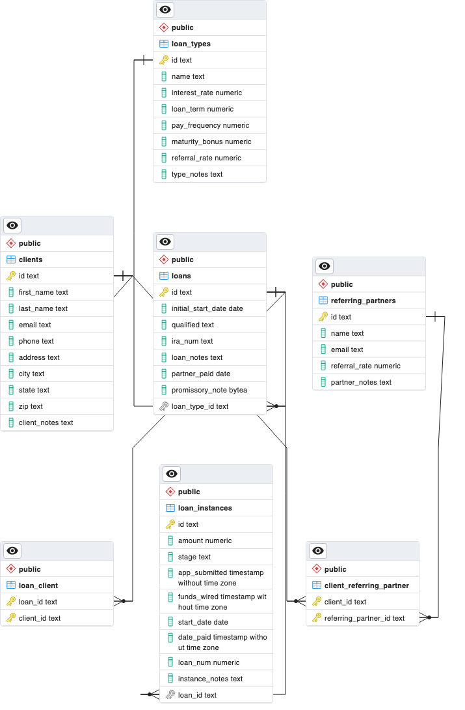

# Overview

The purpose of this project is to create a database using PostgreSQL and then interact with the database using Python. THen programmatically insert data into the database and then query the database for information.

The software first connects to my local database, then creates the tables and their relationships, then inserts data into the tables, and then queries the database for information.

{Provide a link to your YouTube demonstration. It should be a 4-5 minute demo of the software running, a walkthrough of the code, and a view of how created the Relational Database.}

[Software Demo Video](https://youtu.be/o0dsMo36sIo)

# Relational Database

I used a PostgreSQL database to store the data for this project. 

The structure of the tables can be seen in this ERD diagram:

# Development Environment

I used Visual Studio Code for all of my Python code. I also used pgAdmin 4 to check my work and create the ERD diagram. 

I used the following Python libraries:
- psycopg2 (for connecting to the database)
- pandas (for reading the csv files)
- plotly (for the graph at the end)

# Useful Websites

{Make a list of websites that you found helpful in this project}

- [Stack Overflow](https://stackoverflow.com)
Like most programmers, I use this all the time to answer random questions. 
- [PostgreSQL Tutorial](https://www.postgresqltutorial.com/)
This website was very helpful in learning how to use PostgreSQL.

# Future Work

Below are future things that I want to complete in this project: 
- Finish getting all of the CSV data
- Create a more interactive report using Dash
- Share the csv data with others